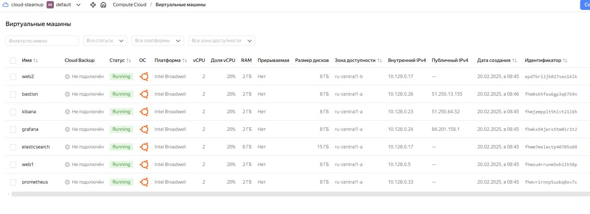
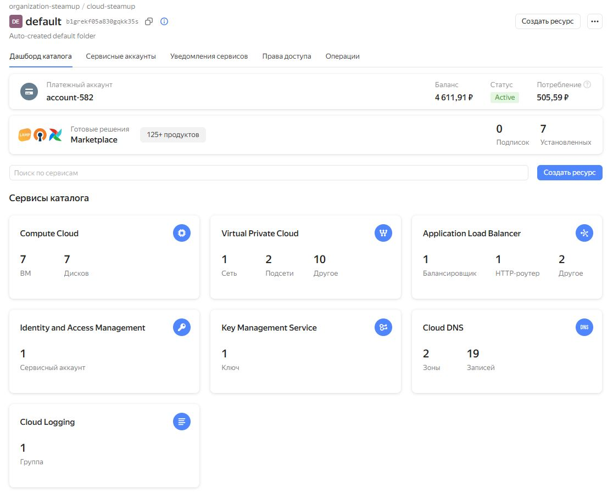
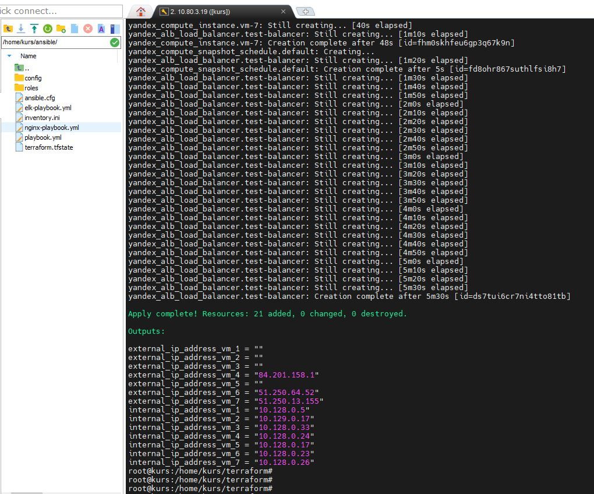
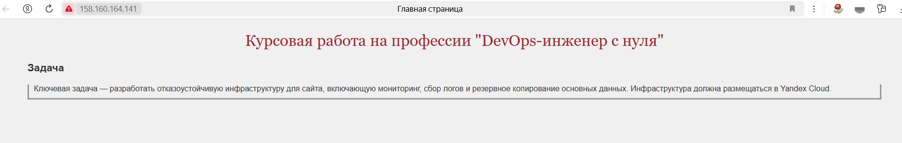
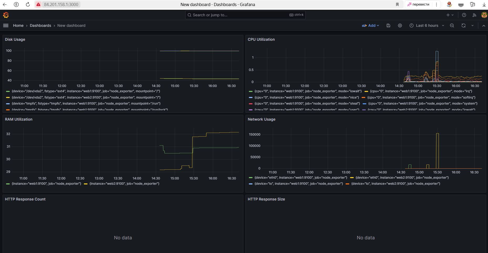
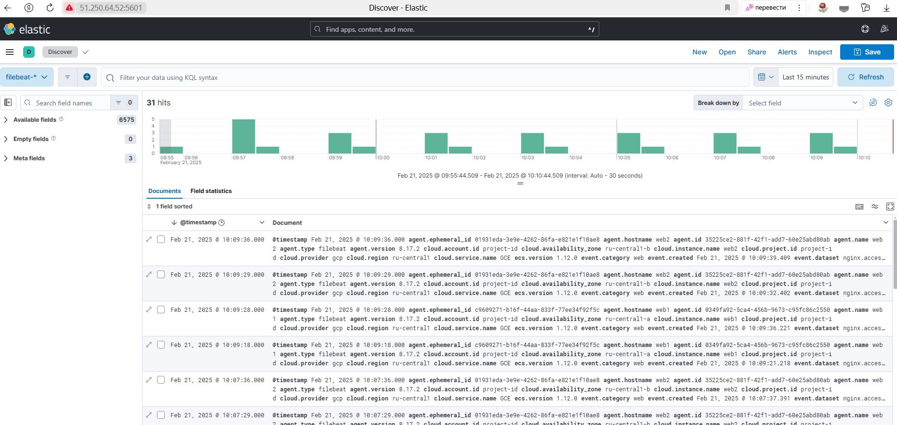

Курсовая работа на профессии "DevOps-инженер с нуля" - <Бычков Денис Вячеславович>

Задача
Ключевая задача — разработать отказоустойчивую инфраструктуру для сайта, включающую мониторинг, сбор логов и резервное копирование основных данных. Инфраструктура должна размещаться в Yandex Cloud.

Выполнение работы

Серверы и инфраструктура в Yandex Cloud созданы с помощью terraform и ansible. В качестве операционной системы для виртуальных машин выбрана Ubuntu 22.04.

Terraform

При помощи terraform разворачиваем сервера.

Все конфигурационные файлы terraform по ссылке.

ССЫЛКА

В облаке разворачиваются виртуальные машины:

web1, web2, prometheus, grafana, elasticsearch, kibana, bastion.

Ansible

Устанавливаем ansible, создаём файлы ansible.cfg, inventory.ini, пишем сценарий.

ССЫЛКА

Сайт

Запускаем первый файл конфигурации: nginx-playbook.yml, который развернет на хостах web1 и web2 веб-сервер nginx с сайтом.

ССЫЛКА

Адрес балансировщика

http://158.160.164.141

Запускаем второй playbook: playbook.yml который устанавливает:

Репозиторий с зеркалом для установки стека ELK — на хостах web1, web2, elasticsearch, kibana.
На хостах web1 и web2 — filebeat, Node-exporter, Nginx Log Exporter
На хосте prometheus - prometheus, node-exporter.
На хосте grafana - grafana.

Мониторинг

ССЫЛКА

http://84.201.158.1:3000

логин: admin

пароль: admin

Логи

Запускаем третий файл playbook: elk-playbook.yml, который устанавливает:

На хосте elasticsearch - elasticsearch.
На хосте kibana - kibana
На хостах web1 и web2 включает модуль nginx и настраивает filebeat

ССЫЛКА

http://51.250.64.52:5601

логин: admin

пароль: password123

